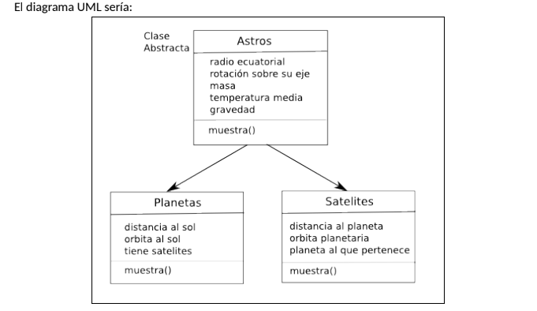

## 1. Dada la siguiente estructura de clases:

``` java
public class Office {}

public class LandraOffice extends Office {}

public class RocheOffice extends Office {}

public class OptimizedLandraOffice extends LandraOffice {}
```


Marca, de las siguientes respuestas, aquellas que al ejecutarlas provocarían una `RuntimeException`.


a. 
``` java
OptimizedLandraOffice optimizedLandraOffice = new OptimizedLandraOffice();
Office office = (Office) optimizedLandraOffice;
```

b. 
``` java
RocheOffice rocheOffice = new RocheOffice();
Office office = (Office) rocheOffice;
LandraOffice landraOffice = (LandraOffice) office;
```

c.
``` java
LandraOffice landraOffice = new LandraOffice();
OptimizedLandraOffice optimizedLandraOffice = (OptimizedLandraOffice) landraOffice;
```

d.
``` java
OptimizedLandraOffice optimizedLandraOffice = new OptimizedLandraOffice();
LandraOffice landraOffice = (LandraOffice) optimizedLandraOffice;
```

e.
``` java
Office office = new Office();
RocheOffice rocheOffice = (RocheOffice) office;
```

f.
``` java
OptimizedLandraOffice optimizedLandraOffice = new OptimizedLandraOffice();
Office office = (Office) optimizedLandraOffice;
LandraOffice landraOffice = (LandraOffice) office;
```


## 2. Implementa la función `count` para que:
- Acepte una lista ordenada de números únicos 
- cuente cuantos elementos de la lista son menores que el parámetro recibido.


Ejemplo: 

*Ejemplo, Search.count(new int[] { 1, 3, 5, 7 }, 4) debería devolver 2 ya que solo hay dos elementos que sean menores que 4.*

Estructura de la clase:

``` java
public class Search {
    public static int count(int[] array, int lesserThan) {
        //resolver aqui
    }
    
    public static void main(String[] args) {
        System.out.println(Search.count(new int[] { 1, 3, 5, 8 }, 4));
    }
}

```


# 3. Supongamos una clase Producto con dos atributos:
- String nombre
- int cantidad

Implementa esta clase con un constructor (con parámetros) además de los getters y setters de sus dos atributos. No es necesario comprobar los datos introducidos.

A continuación, crea un programa (main) que haga lo siguiente:
1. Crea 5 instancias de la Clase Producto.
2. Crea un ArrayList.
3. Añade las 5 instancias de Producto al ArrayList.
4. Visualiza el contenido de ArrayList utilizando Iterator.
5. Elimina dos elemento del ArrayList.
6. Inserta un nuevo objeto producto en medio de la lista.
7. Visualiza de nuevo el contenido de ArrayList utilizando Iterator.
8. Elimina todos los valores del ArrayList.


# 4. Jerarquía de clases: ASTROS
Define una jerarquía de clases que permita almacenar datos sobre los planetas y satélites (lunas) que forman parte del sistema solar.
Algunos atributos que necesitaremos almacenar son:
-  Masa del cuerpo.
-  Diámetro medio.
-  Período de rotación sobre su propio eje.
-  Período de traslación alrededor del cuerpo que orbitan.
-  Distancia media a ese cuerpo.
-  etc.

Define las clases necesarias conteniendo:
-  Constructores.
-  Métodos para recuperar y almacenas atributos.
-  Método para mostrar la información del objeto.

Define un método, que dado un objeto del sistema solar (planeta o satélite), imprima toda la información que se dispone sobre el mismo (además de su lista de satélites si los tuviera).



Una posible solución sería crear una lista de objetos, insertar los planetas y satélites (directamente mediante código) y luego mostrar un pequeño menú que permita al
usuario imprimir la información del astro que elija.


